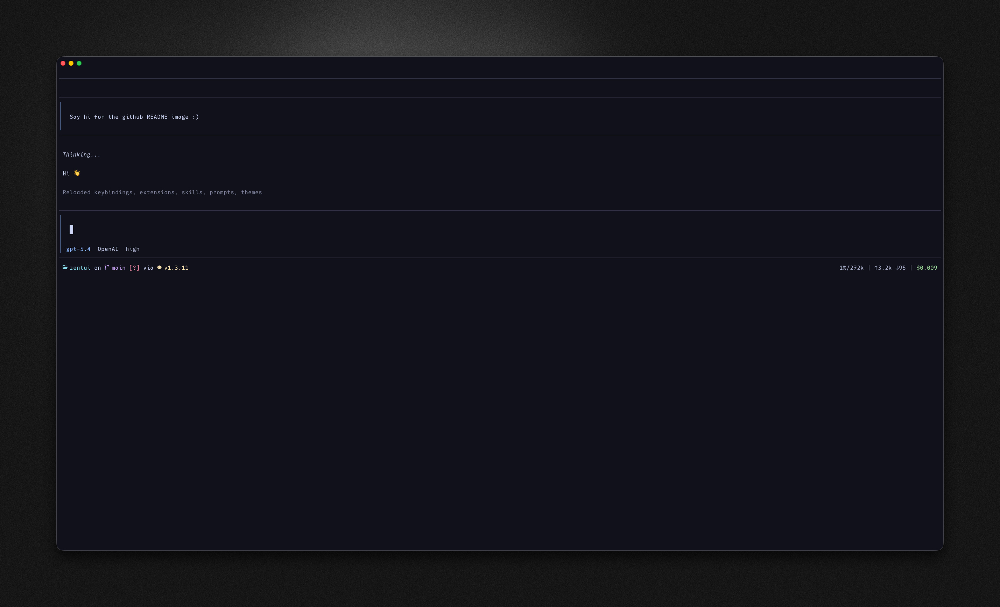

# Zentui

A Starship-inspired statusline and Opencode-style TUI for [Pi](https://github.com/badlogic/pi-mono).

## Screenshots



## What is this?

Zentui brings two popular aesthetics to Pi:

- **[Starship](https://starship.rs/) footer** — shows your current directory, git branch, git status indicators, and runtime/version detection in a compact, icon-rich format
- **[Opencode](https://github.com/opencode-ai/opencode) editor and messages** — clean bordered input box with accent rail, transparent previous messages, and model/provider display inside the editor frame

## Features

### Footer (Starship-inspired)

- `󰝰 dirname` — current directory with icon
- `on  branch` — git branch with icon
- `[!?↑]` — git status indicators (modified, untracked, ahead/behind, stashed, etc.)
- `via  v5.5.0` — runtime detection with version (Bun, Deno, Node, Python, Go, Rust, Lua, Java, Ruby, PHP)
- Right side shows context usage, token counts, and cost

### Editor (Opencode-inspired)

- Bordered input box with accent-colored left rail
- Model name and provider displayed inside the editor frame
- Thinking level indicator when enabled
- Matching style for previous user messages

### Git Status Icons

| Icon | Meaning    |
| ---- | ---------- |
| `!`  | Modified   |
| `?`  | Untracked  |
| `+`  | Staged     |
| `✘`  | Deleted    |
| `»`  | Renamed    |
| `=`  | Conflicted |
| `$`  | Stashed    |
| `↑`  | Ahead      |
| `↓`  | Behind     |
| `⇕`  | Diverged   |

### Runtime Detection

Detects project type and shows runtime version:

| Runtime | Detection                                                   |
| ------- | ----------------------------------------------------------- |
| Bun     | `bun.lock`, `bun.lockb`                                     |
| Deno    | `deno.json`, `deno.jsonc`, `deno.lock`                      |
| Node.js | `package.json`, `.nvmrc`, `.node-version`                   |
| Python  | `pyproject.toml`, `requirements.txt`, `setup.py`, `Pipfile` |
| Go      | `go.mod`                                                    |
| Rust    | `Cargo.toml`                                                |
| Lua     | `stylua.toml`, `.luarc.json`, `init.lua`, `lua/` dir        |
| Java    | `pom.xml`, `build.gradle`                                   |
| Ruby    | `Gemfile`, `.ruby-version`                                  |
| PHP     | `composer.json`                                             |

## Install

```bash
# From npm
pi install npm:Zentui

# From git
pi install git:github.com/milo/Zentui

```

## Config

On first run, Zentui creates a config file at:

```
~/.pi/agent/zentui.json
```

### Default config

```json
{
  "icons": {
    "cwd": "󰝰",
    "git": "",
    "ahead": "↑",
    "behind": "↓",
    "diverged": "⇕",
    "conflicted": "=",
    "untracked": "?",
    "stashed": "$",
    "modified": "!",
    "staged": "+",
    "renamed": "»",
    "deleted": "✘",
    "typechanged": "T"
  },
  "colors": {
    "cwdText": "syntaxOperator",
    "git": "syntaxKeyword",
    "gitStatus": "error",
    "contextNormal": "muted",
    "contextWarning": "warning",
    "contextError": "error",
    "tokens": "muted",
    "cost": "success",
    "separator": "borderMuted"
  }
}
```

### Color values

Colors can be:

- Pi theme token names (e.g., `accent`, `error`, `syntaxKeyword`)
- Hex colors (e.g., `#89b4fa`)

This means Zentui works with any Pi theme — it uses your theme's colors by default.

## Requirements

- [Pi](https://github.com/badlogic/pi-mono) coding agent
- A [Nerd Font](https://www.nerdfonts.com/) for icons

## Credits

Inspired by:

- [Starship](https://starship.rs/) — the minimal, blazing-fast, and infinitely customizable prompt
- [Opencode](https://github.com/opencode-ai/opencode) — terminal-based AI coding assistant

## License

MIT
