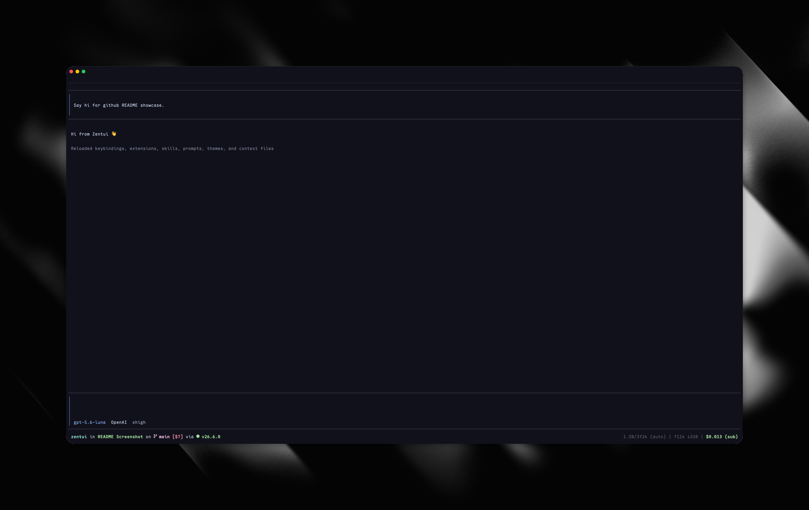
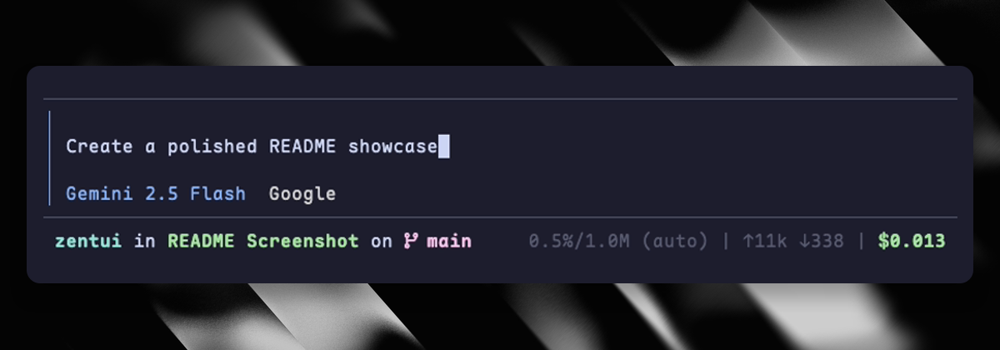
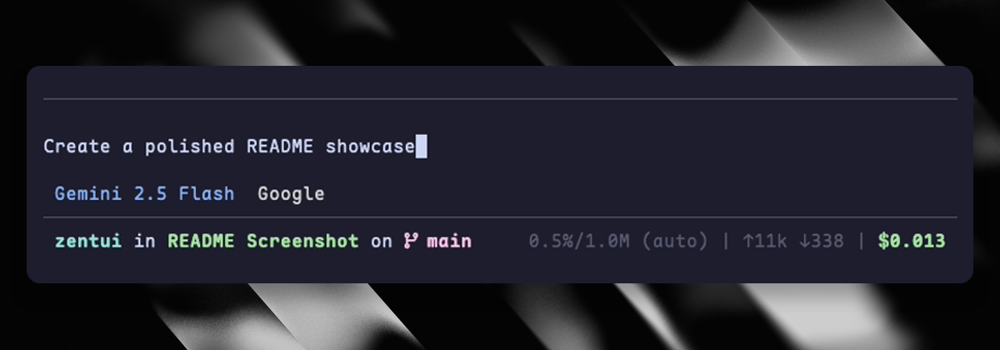
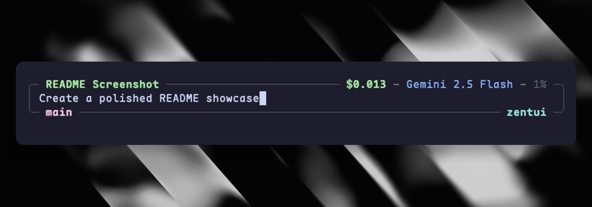
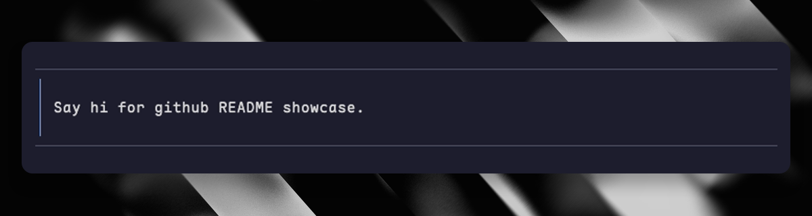
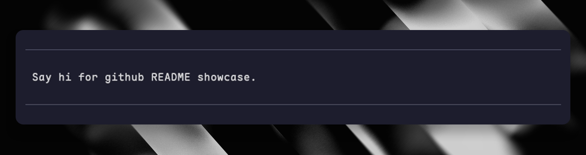
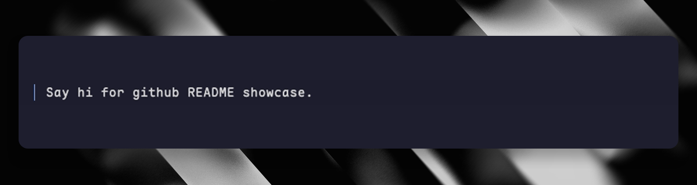
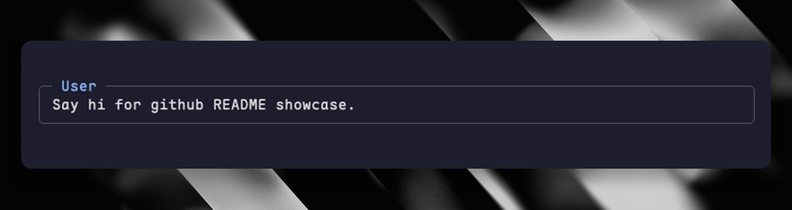

<h1 align="center">Zentui</h1>

<p align="center">A Starship-inspired statusline and Opencode-style TUI for <a href="https://pi.dev">Pi</a>.</p>

<p align="center">
  <a href="https://www.npmjs.com/package/pi-zentui"></a>
  <a href="https://www.npmjs.com/package/pi-zentui"></a>
  <a href="https://github.com/lmilojevicc/pi-zentui/actions/workflows/ci.yml"></a>
  <a href="https://github.com/lmilojevicc/pi-zentui/graphs/contributors"></a>
  <a href="https://github.com/lmilojevicc/pi-zentui/blob/main/LICENSE"></a>
</p>



## What is this?

Zentui styles four major Pi surfaces independently:

- **Editor** — selectable Opencode, Accent Rail, and Minimalist input treatments inspired by [Opencode](https://github.com/opencode-ai/opencode), Oh My Pi, and pi-custom-input
- **User messages** — selectable framed, framed copy-friendly, compact, and labeled transcript messages
- **Working line** — optional ownership and styling of Pi's complete in-progress row
- **[Starship](https://starship.rs/) footer** — current directory, Git, runtime, context, tokens, cost, and other configurable segments

Editor, User messages, Working line, and selector borders use independent `enabled` fields. Footer uses one `style`: `native`, `starship`, or `hidden`. **Appearance** contains selector-border and icon settings.

## Features

### Footer (Starship-inspired)

- `dirname` — current directory (`basename` by default; optional `full` path with directory depth via `pathDisplay`)
- `on  branch` — git branch with icon
- `[!?↑]` — git status indicators (modified, untracked, ahead/behind, stashed, etc.)
- `via  v5.5.0` — runtime detection with version and Starship-style Nerd Font runtime/language modules
- Optional segments (off by default): selected model/provider, `user@host`, current time, OS icon, session duration, and the **project package version** (e.g. `package.json` → `0.6.0`) — distinct from the runtime segment, which shows the installed toolchain
- Right side shows context usage, token counts, and cost
- Built-in footer segments can be shown or hidden individually from `/zentui`
- Fully custom Starship-style layout via the `components.footer.styles.starship.format` template string — see [Footer Format Template](#footer-format-template)
- Third-party Pi extension statuses from `ctx.ui.setStatus()` can be shown on the left,
  middle, or right side, or hidden per status key from `/zentui`

### Editor

- `opencode` (default) keeps an accent rail on every interior row
- `opencode-copy-friendly` (**Opencode (copy-friendly)** in `/zentui`) preserves the low-rail rendering for clean terminal selection
- `accent-rail` (**Accent Rail** in `/zentui`) uses a filled compact input surface, one editor-owned rail on every input row, and no frame or metadata
- `minimalist` moves session name, cost, model, thinking, context, Git, configurable path, Bash state, and turn duration into a rounded frame
- The selected model label and provider appear inside both Opencode editor variants; the model ID is used by default, while `components.editor.modelLabel: "name"` uses the display name with ID fallback.
- Accent Rail autocomplete keeps Pi's native menu content on the same filled surface, replacing only the selected `→` with the configured rail; transparent mode removes its owned input and menu backgrounds. Both Opencode variants default to a transparent full-width completion palette and can independently restore Pi's native trailing list; Minimalist keeps autocomplete inside its rounded frame
- Configurable model, provider, thinking-level, accent, rail, and border colors

Editor styles:

<h4 align="center"><code>opencode</code></h4>



<h4 align="center"><code>opencode-copy-friendly</code></h4>



<h4 align="center"><code>accent-rail</code></h4>

```text
▎ Ask anything, edit files, run tools
▎ settings     Open settings
  files        Search files
```

<h4 align="center"><code>minimalist</code></h4>



### User messages

- `framed` (default) preserves the full-width bordered prompt box with an accent rail
- `framed-copy-friendly` (**Framed (copy-friendly)** in `/zentui`) keeps the full-width horizontal borders and blank spacer rows, removes the copied accent rail, and retains a one-cell leading gutter before body text.
- `compact` uses only an accent rail, with no border or padding rows
- `labeled` uses a rounded box with the fixed label `User`
- Disabling User-message styling delegates byte-for-byte to Pi's native renderer; native is not a style ID
- No custom `plain` message style is provided

User-message previews:

<h4 align="center"><code>framed</code></h4>



<h4 align="center"><code>framed-copy-friendly</code></h4>



<h4 align="center"><code>compact</code></h4>



<h4 align="center"><code>labeled</code></h4>



### Working line

When enabled, the optional Working line always owns and stylizes Pi's complete working-row message and indicator. It provides five fixed-width spinner presets: Braille Orbit, Star Bloom, ASCII Pinwheel, Claude-inspired, and three-cell Pulse. **Custom messages** defaults on and selects once per model turn from an editable, materialized 16-message list. Turning it off keeps the row owned and displays styled, animated `Working…` without random selection. An empty or invalid custom list safely uses the same fallback. The row can show the latest active **Tool**, interaction-wide **Elapsed** time, cumulative wall-clock **Thinking** time, and whole-interaction **Tokens**. Committed totals stay exact and provider-reported across tool loops, automatic retries, compaction retries, and queued continuations. During the current response, live output uses the native `↓N` convention whether it comes from provider usage or an estimate used while provider usage is unavailable or stale. Authoritative final usage always reconciles the response atomically; input is never estimated. Messages and tool labels are sanitized and width-bounded.

When Pi has fully settled and will not continue automatically, the default-on **Turn summary** appends a persistent, context-free transcript row such as `Turn took 56s · thought for 10s · ↑7.1k ↓779`. Thought is cumulative wall-clock time from Pi's public thinking stream; overlapping blocks count once and zero is omitted. Output usage already includes reasoning tokens, so reasoning is not added separately. The summary always includes both token totals—even when live Tokens or Thinking is hidden or both totals are zero—and can be opted out of without affecting historical summaries. Turn summaries use the fixed Working-line high style and are inactive while the overall Working line is disabled.

Spinner glyph motion is always active. Classic and KITT move color across the message and segments by default; **Animate spinner color** optionally includes spinner cells and their separator in that sweep. Static colors the complete row uniformly and ignores text speed and spinner-color participation without changing their saved values. Content fits the 77-cell indicator payload while reserving the complete Tokens label first, then Message, Thought, Elapsed, and Tool allocation, and preserves the visual **Message · Tool · Elapsed · Thought · Tokens** order and complete 80-column Loader-row contract. Active thought appears immediately as `thinking 0s` and updates once per second; completed positive thought appears as `thought for Ns`. Rebuilds preserve the displayed spinner and visible color-sweep position. Pi's working-row APIs are global and unkeyed, so another extension may win by writing last.

| Setting | Default | Presets | Applies to |
| --- | ---: | --- | --- |
| `spinnerIntervalMs` | 100 ms | Fast 60 / Normal 100 / Slow 160 / Custom | Spinner glyph motion |
| `textIntervalMs` | 60 ms | Fast 40 / Normal 60 / Slow 100 / Custom | Classic/KITT color motion |

Both speeds accept safe integers from `30` through `1000` ms. Static ignores text speed without changing it. Classic/KITT combine both cadences through one Pi Loader interval; exact cycles are used within the 1024-frame/512-KiB limits. Pathological custom pairs use a bounded evenly distributed schedule: cycle totals round by at most half a spinner glyph cycle and half a text step, spinner wrap remains continuous, and text phase may reset once per bounded fallback array cycle. Legacy `intervalMs` is accepted only as migration input for `spinnerIntervalMs` when the canonical field is absent.

### Git Status Icons

| Icon | Meaning    |
| ---- | ---------- |
| `!`  | Modified   |
| `?`  | Untracked  |
| `+`  | Staged     |
| `✘`  | Deleted    |
| `»`  | Renamed    |
| `=`  | Conflicted |
| `$`  | Stashed    |
| `↑`  | Ahead      |
| `↓`  | Behind     |
| `⇕`  | Diverged   |

### Runtime Detection

Detects Starship Nerd Font runtime/language modules, uses the Starship Nerd Font symbols, and keeps Starship-style defaults such as `bold green` for Node.js. By default Zentui maps those styles through your active Pi theme; switch the Starship/footer color source to `terminal` in `/zentui` if you want your terminal colorscheme to supply the exact ANSI colors.

| Runtime/language | Detection examples                                            |
| ---------------- | ------------------------------------------------------------- |
| Buf              | `buf.yaml`, `buf.gen.yaml`, `buf.work.yaml`                   |
| Bun              | `bun.lock`, `bun.lockb`                                       |
| C                | `.c`, `.h` files                                              |
| C++              | `.cpp`, `.cc`, `.cxx`, `.hpp` files                           |
| CMake            | `CMakeLists.txt`, `CMakeCache.txt`                            |
| COBOL            | `.cbl`, `.cob` files                                          |
| Conda            | `CONDA_DEFAULT_ENV` environment                               |
| Crystal          | `.cr` files, `shard.yml`                                      |
| Dart             | `.dart` files, `pubspec.yaml`, `.dart_tool/`                  |
| Deno             | `deno.json`, `deno.jsonc`, `deno.lock`                        |
| .NET             | `.csproj`, `.fsproj`, `global.json`, `Directory.Build.*`      |
| Elixir           | `mix.exs`                                                     |
| Elm              | `.elm` files, `elm.json`, `elm-stuff/`                        |
| Erlang           | `rebar.config`, `erlang.mk`                                   |
| Fennel           | `.fnl` files                                                  |
| Fortran          | `.f`, `.f90`, `.f95`, `.f03`, `.f08`, `.f18`, `fpm.toml`      |
| Gleam            | `.gleam` files, `gleam.toml`                                  |
| Go               | `go.mod`                                                      |
| Gradle           | `build.gradle`, `build.gradle.kts`, `gradle/`                 |
| Guix shell       | `GUIX_ENVIRONMENT` environment                                |
| Haskell          | `.hs`, `.cabal`, `stack.yaml`, `cabal.project`                |
| Haxe             | `.hx`, `.hxml`, `haxelib.json`, `.haxerc`                     |
| Helm             | `helmfile.yaml`, `Chart.yaml`                                 |
| Java             | `.java-version`                                               |
| Julia            | `.jl` files, `Project.toml`, `Manifest.toml`                  |
| Kotlin           | `.kt`, `.kts` files                                           |
| Lua              | `.lua` files, `stylua.toml`, `.luarc.json`, `lua/` dir        |
| Maven            | `pom.xml`                                                     |
| Meson            | `MESON_DEVENV=1` and `MESON_PROJECT_NAME` environment         |
| Mojo             | `.mojo` files                                                 |
| Nim              | `.nim`, `.nims`, `.nimble`, `nim.cfg`                         |
| Nix shell        | `IN_NIX_SHELL=pure` or `IN_NIX_SHELL=impure` environment      |
| Node.js          | `package.json`, `.nvmrc`, `.node-version`                     |
| OCaml            | `.opam`, `.ml`, `.mli`, `dune`, `_opam/`, `esy.lock/`         |
| Odin             | `.odin` files                                                 |
| OPA/Rego         | `.rego` files                                                 |
| Perl             | `.pl`, `.pm`, `Makefile.PL`, `cpanfile`, `META.*`             |
| PHP              | `composer.json`                                               |
| Pixi             | `pixi.toml`, `pixi.lock`, `PIXI_ENVIRONMENT_NAME` environment |
| Pulumi           | `Pulumi.yaml`, `Pulumi.yml`                                   |
| PureScript       | `.purs` files, `spago.dhall`, `spago.yaml`, `spago.lock`      |
| Python           | `pyproject.toml`, `requirements.txt`, `setup.py`, `Pipfile`   |
| R                | `.R`, `.Rmd`, `.Rproj`, `DESCRIPTION`, `.Rproj.user/`         |
| Raku             | `.raku`, `.rakumod`, `.p6`, `.pm6`, `META6.json`              |
| Red              | `.red`, `.reds` files                                         |
| Ruby             | `Gemfile`, `.ruby-version`                                    |
| Rust             | `Cargo.toml`                                                  |
| Scala            | `.scala`, `.sbt`, `build.sbt`, `.metals/`                     |
| Solidity         | `.sol` files                                                  |
| Spack            | `SPACK_ENV` environment                                       |
| Swift            | `.swift` files, `Package.swift`                               |
| Terraform        | `.tf`, `.tfplan`, `.tfstate`, `.terraform/`                   |
| Typst            | `.typ` files, `template.typ`                                  |
| Vagrant          | `Vagrantfile`                                                 |
| V                | `.v` files, `v.mod`, `vpkg.json`                              |
| Xmake            | `xmake.lua`                                                   |
| Zig              | `.zig` files, `build.zig`                                     |

## Install

```bash
# From npm
pi install npm:pi-zentui

# From git
pi install git:github.com/lmilojevicc/pi-zentui
```

## Config

User config lives at `~/.pi/agent/zentui.json`. The file is optional: missing or invalid known values fall back to Zentui defaults, unknown keys are ignored at runtime, and `/zentui` can patch color-source settings, UI feature toggles, built-in footer segment visibility, and active third-party status placements.

The interactive `/zentui` menu is split into exactly eight component-oriented sections, in this order. Use `Tab` and `Shift+Tab` to switch sections:

1. **Appearance** — selector-border enablement, style, and colors; icon mode.
2. **Editor** — editor enablement, style, colors, model label, border behavior, viewport indicators, settings for the selected editor style, and a static synthetic preview.
3. **User messages** — message enablement, `framed | framed-copy-friendly | compact | labeled` style selection (including **Framed (copy-friendly)**), colors, and a static synthetic Markdown preview.
4. **Working line** — ownership, settled Turn summary, spinner and text speeds, optional spinner-color motion, text animation, color source, custom-message toggle and editable list, Tool/Elapsed/Thinking/Tokens toggles, and animated preview.
5. **Footer** — `Native | Starship | Hidden` style selection. Starship additionally shows colors, model label, responsive layout, separator, context style, and path display.
6. **Segments** — visibility toggles for non-Git Starship segments.
7. **Git** — Starship Git segment and probe controls.
8. **Extensions** — Starship extension-status placement and color controls for active keys.

Editor, User messages, and Working line retain independent configuration. Editor and User-message previews use fixed synthetic content and remain visible while their component is disabled; the Working-line preview reflects its current configured sample, state, and animation. Each preview appears above its settings. Only the Working-line preview owns an animation timer. Footer's single style selects Pi's built-in Footer (`Native`), Zentui's Starship Footer, or an owned zero-row Footer (`Hidden`). Color and model-label rows update only their owning component.

Starship-specific Footer rows are shown only while Starship is selected. The **Segments**, **Git**, and **Extensions** sections remain available for preconfiguration under every Footer style. Free-form values such as custom formats, Opencode metadata format, raw colors/styles, and inactive extension keys remain JSON-only; Working-line speed accepts validated custom milliseconds in `/zentui`.

Useful slash-command shortcuts:

```text
/zentui editor enable
/zentui editor disable
/zentui statusline enable
/zentui statusline disable
/zentui editor toggle
/zentui messages enable
/zentui messages disable
/zentui messages toggle
/zentui statusline toggle
/zentui messages
/zentui user-messages
/zentui working-line
/zentui viewport-indicators enable
/zentui viewport-indicators disable
/zentui viewport-indicators toggle
/zentui format "$cwd on branch $git_branch$git_status using $runtime $fill $context"
/zentui format clear
```

`footer`, `statusline`, `status`, and `status line` are aliases: enable selects Starship, disable selects Native, and toggle selects Native only from Starship (Native or Hidden toggle to Starship).

Default config values — copy this and change any value you want:

```json
{
	"projectRefreshIntervalMs": 30000,
	"components": {
		"editor": {
			"enabled": true,
			"style": "opencode",
			"colorSource": "theme",
			"borderColorMode": "static",
			"modelLabel": "id",
			"viewportIndicators": true,
			"styles": {
				"opencode": {
					"metadataFormat": "$model  $provider(  $thinking)",
					"completionMenu": "palette"
				},
				"opencode-copy-friendly": {
					"metadataFormat": "$model  $provider(  $thinking)",
					"completionMenu": "palette"
				},
				"accent-rail": {
					"rail": "▎",
					"asciiRail": "|",
					"transparent": false
				},
				"minimalist": {
					"pathDisplay": "compact",
					"contextFormat": "percent",
					"contextGauge": false,
					"showSessionName": true,
					"showTimer": true,
					"showCost": true,
					"showGit": true,
					"contextThresholds": {
						"warning": 70,
						"error": 90
					}
				}
			}
		},
		"userMessages": {
			"enabled": true,
			"style": "framed",
			"colorSource": "theme",
			"styles": {
				"framed": {},
				"framed-copy-friendly": {},
				"compact": {},
				"labeled": {}
			}
		},
		"workingLine": {
			"enabled": false,
			"turnSummary": true,
			"spinner": "star-bloom",
			"spinnerIntervalMs": 100,
			"animateSpinnerColor": false,
			"textIntervalMs": 60,
			"textAnimation": "classic",
			"colorSource": "theme",
			"messages": {
				"custom": true,
				"values": [
					"Sautéing…", "Cooking…", "Ionizing…", "Zigzagging…",
					"Razzle-dazzling…", "Photosynthesizing…", "Nucleating…", "Brewing…",
					"Combobulating…", "Boogieing…", "Befuddling…", "Alchemizing…",
					"Conjuring…", "Baking…", "Simmering…", "Blanching…"
				]
			},
			"segments": {
				"tool": true,
				"elapsed": true,
				"thought": true,
				"tokens": true
			}
		},
		"selectorBorders": {
			"enabled": true,
			"style": "zentui",
			"colorSource": "theme"
		},
		"footer": {
			"style": "starship",
			"colorSource": "theme",
			"modelLabel": "id",
			"styles": {
				"starship": {
					"format": "",
					"responsive": true,
					"compactFormat": "$cwd$wrap(in $session_name)$wrap(on $git_branch) $git_status$wrap$context$wrap_sep$tokens",
					"compactMaxLines": 2,
					"separator": "pipe",
					"contextStyle": "text",
					"contextThresholds": {
						"warning": 70,
						"error": 90
					},
					"pathDisplay": {
						"mode": "basename",
						"depth": 0
					},
					"segments": {
						"cwd": true,
						"sessionName": true,
						"gitBranch": true,
						"gitStatus": true,
						"gitCounts": false,
						"runtime": true,
						"modelInfo": false,
						"context": true,
						"tokens": true,
						"cost": true,
						"sessionDuration": false,
						"username": false,
						"time": false,
						"os": false,
						"packageVersion": false,
						"gitCommit": false,
						"gitMetrics": false
					},
					"gitBranch": {
						"maxLength": "full"
					},
					"gitCommit": {
						"hashLength": 7,
						"onlyDetached": true,
						"showTag": true
					},
					"gitMetrics": {
						"onlyNonzero": true,
						"ignoreSubmodules": false
					},
					"extensionStatuses": {
						"defaultPlacement": "right",
						"placements": {},
						"colorModes": {}
					}
				}
			}
		}
	},
	"icons": {
		"mode": "auto",
		"cwd": "",
		"git": "",
		"ahead": "↑",
		"behind": "↓",
		"diverged": "⇕",
		"conflicted": "=",
		"untracked": "?",
		"stashed": "$",
		"modified": "!",
		"staged": "+",
		"renamed": "»",
		"deleted": "✘",
		"typechanged": "T",
		"cacheHit": "󰆼",
		"editorPrompt": "",
		"rail": "│",
		"username": "",
		"time": "",
		"os": ""
	},
	"colors": {
		"cwd": "bold cyan",
		"sessionName": "bold green",
		"gitBranch": "bold purple",
		"gitStatus": "bold red",
		"contextNormal": "bright-black",
		"contextWarning": "bold yellow",
		"contextError": "bold red",
		"tokens": "bright-black",
		"cost": "bold green",
		"extensionStatus": "bright-black",
		"separator": "bright-black",
		"runtimePrefix": "",
		"sessionDuration": "yellow",
		"packageVersion": "208",
		"gitCommit": "bold green",
		"gitMetricsAdded": "bold green",
		"gitMetricsDeleted": "bold red",
		"username": "bold yellow",
		"time": "bold yellow",
		"os": "bold white",
		"editorAccent": "accent",
		"editorPrompt": "accent",
		"editorBorder": "borderMuted",
		"editorModel": "accent",
		"editorProvider": "text",
		"editorThinking": "muted",
		"editorThinkingMinimal": "thinkingMinimal",
		"editorThinkingLow": "thinkingLow",
		"editorThinkingMedium": "thinkingMedium",
		"editorThinkingHigh": "thinkingHigh",
		"editorThinkingXhigh": "thinkingXhigh"
	}
}
```

- Style values can be Starship/terminal strings (`bold purple`, `fg:202`, `#89b` / `#89b4fa`, `bg:blue fg:bright-green`) or Pi theme tokens (`accent`, `borderMuted`, `thinkingHigh`). Short `#rgb` hex values expand to `#rrggbb`.
- `projectRefreshIntervalMs`: project status polling interval; `0` disables polling. Values `1..4999` clamp up to `5000` (minimum 5s); invalid/non-finite values fall back to `30000`.
- `components.editor`: owns editor enablement, `opencode | opencode-copy-friendly | accent-rail | minimalist` style selection, color source, border mode, model label, viewport indicators, and all four editor-style configurations.
- `components.userMessages`: owns message enablement, `framed | framed-copy-friendly | compact | labeled` style selection, and color source. `framed-copy-friendly` remains Zentui-rendered; disabling the component delegates to Pi's native renderer.
- `components.workingLine`: `enabled` is the sole ownership switch. While enabled, Zentui owns both the Working-row message and indicator and renders the full row. It configures `braille | star-bloom | pinwheel | claude-inspired | pulse`, independent spinner/text speeds, optional Classic/KITT spinner-color participation, `classic | kitt | disabled` text animation, color source, the default-on `messages.custom` toggle and editable 16-value list, plus Tool/Elapsed/Thinking/Tokens segments. Thinking only controls the live row; measurement and final summaries continue while it is hidden. Custom-off and empty-list fallback both render owned `Working…`; Static keeps glyph motion but ignores text speed and spinner-color participation.
- Optional `colors.workingLineLow`, `colors.workingLineMid`, and `colors.workingLineHigh` override its palette. Without overrides, theme mode uses `dim`, `muted`, and `bold accent`; terminal mode uses `bright-black`, `cyan`, and `bold cyan`.
- `components.selectorBorders`: owns selector-border enablement, the fixed `zentui` style, and its color source.
- `components.footer`: owns `native | starship | hidden` style selection, Footer color source, Footer model label, and every Starship option under `styles.starship` (formats, segments, context thresholds, path, Git, and extension statuses). Native restores Pi's built-in Footer; Hidden installs an empty component with zero rows.
- Editor and Footer `modelLabel` values are independent and have separate controls in the **Editor** and **Footer** sections.
- Selector borders support only `zentui`; set their owning `enabled` field to `false` for native Pi behavior.
- Flat released keys such as `editorStyle`, `features`, and `footerFormat` remain accepted as migration input. `components.footer.enabled` and `features.statusLine` migrate to Starship or Native when no valid Footer style is present; Hidden projects `features.statusLine: false`. Canonical `components` paths are the primary JSON interface, and component saves materialize canonical snapshots.
- Explicit unsupported future component style IDs are preserved unchanged on disk but fail open at runtime: Editor, User-message, and selector-border customization stay disabled, while Footer behavior is Native. Missing, empty, or malformed style values continue normal default and legacy migration behavior.
- The flat properties returned by `mergeConfig`, `loadConfig`, and save helpers are deprecated compatibility output and will remain available until at least the next major release. This output deprecation is separate from accepted legacy flat JSON input.
- `polished` and `polished-copy-friendly` remain read-only migration aliases for `opencode` and `opencode-copy-friendly`. Legacy `features.copyFriendly` and the old nested Editor/message `copyFriendly` fields are read-only migration inputs: message copy-friendly `true` selects `framed-copy-friendly` rather than disabling custom rendering. Explicit Editor or User-message style saves remove only the corresponding obsolete nested flag; raw released feature keys, unknown fields, and unknown style data remain preserved as user-owned migration data.
- The shown `editor*` values match the default `theme` source. Omit those keys to keep Zentui's source-aware defaults when switching between `theme` and `terminal`.
- `editorAccent` styles Opencode Editor and User-message accent rails plus the labeled message label.
- Optional `editorRail` styles only the Accent Rail editor. When omitted, theme mode uses warm `syntaxNumber` and terminal mode uses portable color 215; it never inherits `editorAccent`.
- `editorPrompt` styles the `opencode-copy-friendly` Editor prompt glyph. Omit it to use `editorAccent`, then the default accent fallback.
- `editorBorder` styles the `framed` and `framed-copy-friendly` previous-message top/bottom borders and the active editor in static border color mode; the border glyph stays `─`.
- `editorGitBranch` and `editorThinkingMax` are optional editor-owned overrides, omitted above so source-specific and adaptive defaults remain active. `editorGitBranch` owns the minimalist Editor branch color independently from Footer `gitBranch`; where Zentui resolves configured thinking colors, `max` falls back through `editorThinkingXhigh` and then `editorThinking`.
- `editorModel`, `editorProvider`, and `editorThinking*` style the editor metadata. `editorThinking` applies to every non-`off` thinking level unless a level-specific key is set.

Tip: with `opencode-copy-friendly`, setting Pi's `editorPaddingX` to `1` in `~/.pi/agent/settings.json` keeps a small left gutter without copying a rail glyph.

## Accent Rail editor style

Set `components.editor.style` to `accent-rail` or select **Accent Rail** from the `/zentui` **Editor** tab. Each rendered input row uses the style-owned `rail` glyph (`▎`, or `asciiRail` in ASCII icon mode), one blank cell before text, and Pi's neutral filled surface. It intentionally has no prompt glyph, metadata, enclosing border, or blank chrome row. Viewport counts appear only while content is clipped. Known autocomplete rows keep Pi's native text, descriptions, and scrolling on the same full-width surface; the selected native `→` becomes the configured rail marker without replacing Pi's selected-text color. Unknown third-party editor layouts fail open without decoration using the already-rendered native rows.

`components.editor.styles["accent-rail"].transparent` defaults to `false`. Set it to `true`, or choose **Transparent** from the Accent Rail surface control in `/zentui`, to remove only Zentui-owned input and autocomplete backgrounds while preserving geometry, rail/text colors, and native autocomplete backgrounds. The rail and gap are rendered decoration, not part of the underlying prompt text. Terminal drag or rectangular selection can still include visible decoration; choose `opencode-copy-friendly` when selection must avoid a rail entirely.

## Minimalist editor style

Set `components.editor.style` to `minimalist` or select it from the `/zentui` **Editor** tab. The rounded frame shows viewport counts, Bash state, the current/completed turn duration, and the explicit Pi session name at top left; cost, model, thinking level, and context usage at top right; viewport count plus Git branch/status at bottom left; and the configured path at bottom right. Unnamed sessions add no placeholder. Autocomplete stays inside the frame when Pi's existing editor output can be split safely. Unknown third-party editor layouts fail open without decoration.

The Minimalist editor is inspired by [pi-custom-input](https://github.com/VinhLe1410/pi-custom-input), with an independent implementation in Zentui.

While `minimalist` is selected, the `/zentui` **Editor** area shows its focused controls without repeating the style name on every row. Path examples are `src` (`compact`), `zentui/src` (`project`), and `~/Projects/zentui/src` (`full`). Context can render as `11%`, `11%/372k`, or—with the gauge enabled and enough room—`[█░░░░] 11%/372k`. The gauge shortens or disappears before the context text at narrow widths. Session name, timer, cost, and Git can be hidden independently; model, thinking, and context remain structurally stable.

Footer visibility is controlled by `components.footer.style`: use `starship`, `native`, or `hidden`. Minimalist editor decoration and the Starship Footer may be shown together, including at narrow widths or after decoration fallback. Minimalist style does not remove Pi's header.

## Opencode completion menu

Both Opencode variants default to `completionMenu: "palette"`, configurable independently in JSON or through the active style's **Completion menu** control in `/zentui`. The transparent palette keeps Pi's captured native result rows and any native embedded backgrounds, removes only a recognized selected `→` while preserving native selected-text emphasis, omits a narrowly recognized trailing native count row such as `(1/47)`, fills the available width without adding a menu background, and adds a bottom separator plus `↑↓ Navigate   Enter Use   Esc Close`. It intentionally has no results header, range, category column, selected background, or side borders because Pi does not expose that structured data through a stable public completion API.

Set one variant to `"native"` to preserve Pi's trailing rows byte-for-byte. Palette mode adds full-width padding and help text to visible terminal output, so `opencode-copy-friendly` users who prioritize clean rectangular selection may prefer its independent Native setting. If autocomplete capture or frame provenance is ambiguous after rendering, Zentui returns those same native rows unchanged rather than rendering the editor again; Accent Rail and framed styles may therefore retain their reduced probe width on this rare fail-open path. Once compatible string rows are captured, Palette applies its surface to them; selected prefixes and trailing count rows are rewritten only when they match the narrow native patterns, while unrecognized forms remain visible.

## Editor Metadata Format

Set `metadataFormat` under either opencode style in `~/.pi/agent/zentui.json` to customize that style's metadata row. The two variants retain independent values:

```json
{
	"components": {
		"editor": {
			"styles": {
				"opencode": {
					"metadataFormat": "$model_name ($model_id)( · $provider)( · $thinking)( · $session_name)"
				},
				"opencode-copy-friendly": {
					"metadataFormat": "$model( · $provider)"
				}
			}
		}
	}
}
```

The syntax follows the Footer Format Template conventions: `$variable` and `${variable}` references, literal text and spaces, and conditional groups `( ... )` that disappear when all variables inside are empty. Unknown variables and `$fill` render empty; `$fill` never creates an editor layout zone because the right side remains reserved for structural Vim status.

| Token           | Renders                                                                                       |
| --------------- | --------------------------------------------------------------------------------------------- |
| `$model`        | label selected by `components.editor.modelLabel` (`id`, or name with ID fallback)            |
| `$model_id`     | active Pi model ID                                                                            |
| `$model_name`   | active Pi model display name; empty when no name is set                                       |
| `$provider`     | provider label using Zentui's existing formatting                                             |
| `$thinking`     | current thinking level; empty when thinking is `off`                                          |
| `$session_name` | current Pi session name; empty when unnamed                                                    |

Model variables use `editorModel`, provider uses `editorProvider`, and thinking uses the matching `editorThinking*` style. Literal text and `$session_name` use the neutral editor border theme style. The template controls spacing. ANSI/VT sequences, control characters, and line-breaking whitespace are sanitized before rendering without collapsing ordinary spaces.

Missing, non-string, or empty values use the default `$model  $provider(  $thinking)`. A non-empty format that resolves to no visible metadata keeps the normal blank spacer and metadata rows so the editor frame height remains stable. This option is configured only through JSON in its first version; `/zentui format` continues to control the footer only.

## Footer Format Template

For full control, set `components.footer.styles.starship.format` to a Starship-style template string. It supports `$variable` and `${variable}` tokens, a special `$fill` token that splits the line into left and right zones, and conditional groups `( ... )` that drop entirely when every nested variable is empty. When set, it overrides `components.footer.styles.starship.segments`; when empty or omitted, the segment layout above is used.

A second `$fill` creates a **centered middle zone** — content between the two fills is true-centered (`floor((gap - middle) / 2)`), just like third-party statuses placed `middle`.

```json
{
	"components": {
		"footer": {
			"styles": {
				"starship": {
					"format": "$os $username $cwd($sep$session_name)( on $git_branch)( $git_status)( via $runtime)$fill($context)($sep$tokens)($sep$cost)($sep$time)"
				}
			}
		}
	}
}
```

Center the branch between directory and cost:

```json
{
	"components": {
		"footer": {
			"styles": {
				"starship": {
					"format": "$cwd $fill $git_branch $fill $cost"
				}
			}
		}
	}
}
```

The released flat `footerFormat` and `footerSegments` keys remain accepted only as legacy migration inputs.

### Variables

| Token               | Aliases      | Renders                                                             |
| ------------------- | ------------ | ------------------------------------------------------------------- |
| `$cwd`              | `$directory` | current directory                                                   |
| `$session_name`     |              | current Pi session name                                             |
| `$git_branch`       | `$branch`    | git branch with icon                                                |
| `$git_status`       | `$status`    | `[!?↑]` status block                                                |
| `$git_state`        | `$state`     | `REBASING` / `MERGING` / … (optional `n/m`)                         |
| `$git_commit`       | `$commit`    | short commit hash (+ exact-match tag when present)                  |
| `$git_tag`          | `$tag`       | exact-match tag at HEAD                                             |
| `$git_metrics`      |              | aggregate line changes `+added −deleted`                            |
| `$git_added`        |              | added line count (`+N`)                                             |
| `$git_deleted`      |              | deleted line count (`−N`)                                           |
| `$runtime`          |              | runtime icon + version                                              |
| `$model`            |              | selected model label (`components.footer.modelLabel`)                |
| `$provider`         |              | formatted provider label                                            |
| `$package`          |              | project package version, `is <glyph> <version>` (manifest-derived)  |
| `$package_version`  |              | raw project package version (no icon)                               |
| `$session_duration` | `$duration`  | session running time                                                |
| `$username`         |              | `user@host`                                                         |
| `$os`               |              | operating-system icon                                               |
| `$time`             |              | current time `HH:MM`                                                |
| `$context`          |              | context usage (text and/or gauge; finite percentages use one decimal) |
| `$tokens`           |              | input/output counts and existing cache-hit percentage               |
| `$cache_read`       |              | cache-read total (`R1.2k`); empty at zero or when unavailable       |
| `$cache_write`      |              | cache-write total (`W300`); empty at zero or when unavailable       |
| `$cost`             |              | session cost                                                        |
| `$subscription`     |              | `(sub)` in subscription mode; otherwise empty                       |
| `$auto_compaction`  |              | `(auto)` when automatic compaction is enabled; otherwise empty      |
| `$sep`              | `$separator` | themed `\|` using `colors.separator`                               |
| `$fill`             | —            | special: splits zones                                               |

### `$fill` behavior

| `$fill` count | Layout                                                                   |
| ------------- | ------------------------------------------------------------------------ |
| 0             | everything left-aligned                                                  |
| 1             | tokens before → left, tokens after → right                               |
| 2             | before first → left, between → **centered middle**, after second → right |
| 3+            | first two count; extras ignored                                          |

- Literal text (`on branch`, `using`, `\|`, spaces) is rendered verbatim — you control all spacing.
- Each variable renders its core value only (no `on`/`via` prefixes); add those words as literal text.
- Conditional groups: wrap optional pieces in parentheses, e.g. `$cwd( on $git_branch)($git_status)$fill($context)`. If every `$var` inside a group is empty, the whole group (including its literals) is dropped.
- `$session_name` is available whenever `components.footer.styles.starship.format` is set, independently of `components.footer.styles.starship.segments.sessionName`; use a conditional group such as `($sep$session_name)` so unnamed sessions leave no separator.
- The built-in wide footer appends cache totals to the token segment, `(sub)` to cost, and `(auto)` to context when available. Custom formats keep `$tokens`, `$cost`, and `$context` backward-compatible and include telemetry only through the atomic variables above.
- `DEFAULT_COMPACT_FOOTER_FORMAT` omits model/provider and atomic telemetry. Add their variables explicitly to `components.footer.styles.starship.compactFormat` to opt in at narrow widths. The flat `compactFooterFormat` key is a legacy migration input.
- Auto-compaction settings refresh on the next normal footer synchronization event. Unsupported Pi capabilities or settings-read errors safely omit optional markers.
- Unknown `$variables` render empty.
- Set or clear at runtime: `/zentui format "<template>"` and `/zentui format clear`.

## Pi fullscreen mode

Pi 0.84 introduces a native fullscreen TUI with a sticky editor and Footer plus an independently scrollable transcript. Enable it in Pi's `~/.pi/agent/settings.json`:

```json
{
	"tuiMode": "fullscreen"
}
```

You can also select fullscreen from Pi's `/settings` UI or start Pi with `--tui-mode fullscreen`. Zentui does not enable fullscreen automatically: Pi owns terminal layout, scrolling, and sticky placement, while Zentui supplies the configured editor and Footer components. Pi 0.80.5–0.83 remain supported for Zentui styling, without native sticky placement.

## Acknowledgments

The Accent Rail editor is inspired by Oh My Pi, with an independent implementation in Zentui. The Minimalist frame's information hierarchy was inspired by [VinhLe1410/pi-custom-input](https://github.com/VinhLe1410/pi-custom-input) and is integrated with Zentui's existing editor, state, configuration, and compatibility layers.

## Requirements

- [Pi](https://pi.dev) coding agent 0.80.5 or newer
- A [Nerd Font](https://www.nerdfonts.com/) for icons (or set `icons.mode` to `"ascii"`)

## Development

```bash
npm install
npm run verify
npm run fmt
npm run pack:check
```

### Test in Pi

The project keeps Pi core packages as peer dependencies for runtime and dev dependencies for
typechecking. To avoid accidentally running the local `node_modules/.bin/pi` shim, the dev scripts use
the globally installed Pi binary by default:

```bash
npm run pi:dev
npm run pi:install-local
```

Override the binary if your Pi install is somewhere else:

```bash
PI_BIN=/path/to/pi npm run pi:dev
```

## Credits

Inspired by:

- [Starship](https://starship.rs/) — the minimal, blazing-fast, and infinitely customizable prompt
- [Opencode](https://github.com/opencode-ai/opencode) — terminal-based AI coding assistant

## License

MIT
